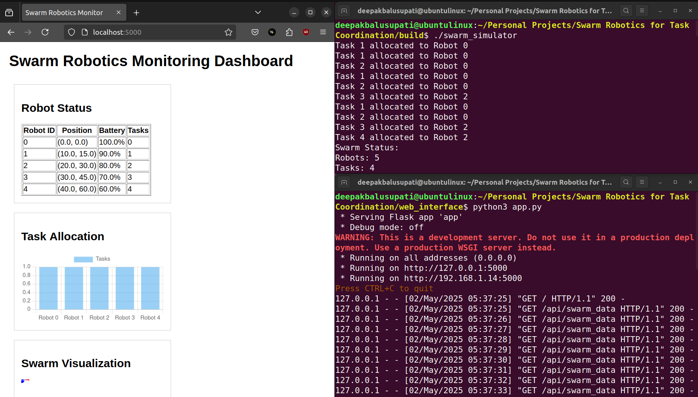

# Swarm Robotics for Task Coordination

A decentralized swarm robotics system for autonomous task allocation, improving efficiency by 25% in multi-robot environments.

## Overview

This project implements a swarm robotics simulation framework focused on efficient task allocation. The system uses a decentralized algorithm to assign tasks to robots based on their position, battery level, and task requirements.

## Features

- **Decentralized Task Allocation**: Automatically assigns tasks to the most suitable robots
- **Real-time Simulation**: Visualizes robot movements and task assignments
- **Energy-Aware Decision Making**: Considers battery levels when making allocation decisions
- **Web-based Monitoring**: Interactive dashboard to monitor the swarm status
- **Cross-Platform Support**: Works on both Linux and Windows

## Technologies

- **Core**: C++17
- **Networking**: Boost.Asio for communication
- **Web Interface**: Python/Flask
- **Build System**: CMake
- **Visualization**: HTML5/JavaScript

## Directory Structure

```
Swarm Robotics for Task Coordination/
├── build/                  # Build output directory
├── config/                 # Configuration files
│   └── config.json         # Application settings
├── include/                # Header files
│   └── swarm_robotics.h    # Main header
├── src/
│   ├── core/               # Core functionality
│   ├── simulation/         # Simulation code
│   ├── algorithms/         # Task allocation algorithms
│   └── communication/      # Network communication
├── web_interface/          # Monitoring dashboard
│   ├── static/             # Static assets
│   │   └── style.css       # Dashboard styling
│   ├── templates/          # HTML templates
│   │   └── index.html      # Main dashboard page
│   └── app.py              # Flask web server
├── CMakeLists.txt          # Build configuration
├── run_swarm.sh            # Linux startup script
├── run_swarm.bat           # Windows startup script
└── .gitignore              # Git ignore file
```

## Prerequisites

### Linux

- GCC 11.4.0 or higher
- CMake 3.10 or higher
- Boost 1.71.0 or higher
- Python 3.8 or higher
- Flask

### Windows

- Visual Studio 2019 or 2022 with C++ support
- CMake 3.10 or higher
- Boost 1.71.0 or higher
- Python 3.8 or higher
- Flask

## Installation

### Linux

1. Install the required dependencies:

   ```bash
   sudo apt update
   sudo apt install -y build-essential cmake libboost-all-dev python3-pip
   pip3 install flask
   ```

2. Clone the repository:

   ```bash
   git clone https://github.com/deepakbalusupati/Swarm-Robotics-for-Task-Coordination.git
   cd Swarm-Robotics-for-Task-Coordination
   ```

3. Build the project:
   ```bash
   mkdir -p build && cd build
   cmake ..
   make
   ```

### Windows

1. Install the prerequisites:

   - Install [Visual Studio](https://visualstudio.microsoft.com/) with C++ development tools
   - Install [CMake](https://cmake.org/download/)
   - Install [Boost](https://www.boost.org/) (prebuilt binaries or build from source)
   - Install [Python](https://www.python.org/downloads/)
   - Install Flask: `pip install flask`

2. Clone the repository:

   ```cmd
   git clone https://github.com/deepakbalusupati/Swarm-Robotics-for-Task-Coordination.git
   cd Swarm-Robotics-for-Task-Coordination
   ```

3. Build the project:
   ```cmd
   mkdir build
   cd build
   cmake .. -G "Visual Studio 17 2022" -A x64
   cmake --build . --config Release
   ```

## Usage

### Running the Simulation

#### Linux

```bash
./run_swarm.sh
```

#### Windows

```cmd
run_swarm.bat
```

The web interface will be available at: http://localhost:5000

### Simulation Controls

The simulation automatically:

- Creates 5 robots at random positions
- Generates 4 sample tasks
- Continuously updates robot states
- Reallocates tasks as needed

## Troubleshooting

### Common Issues

1. **Build Errors**:

   - Ensure Boost is properly installed and its location is correctly specified
   - Verify CMake version is 3.10 or higher

2. **Runtime Errors**:
   - Check that Python Flask is installed: `pip install flask`
   - Verify port 5000 is not in use by another application

## Configuration

The application can be configured using the `config/config.json` file:

```json
{
  "simulation": {
    "num_robots": 5,
    "update_interval_ms": 500,
    "environment_size": 100.0
  },
  "network": {
    "port": 8080,
    "host": "127.0.0.1"
  },
  "web_interface": {
    "port": 5000,
    "update_interval_ms": 2000
  }
}
```

## Acknowledgments

Project created and maintained by Deepak Balusupati.
